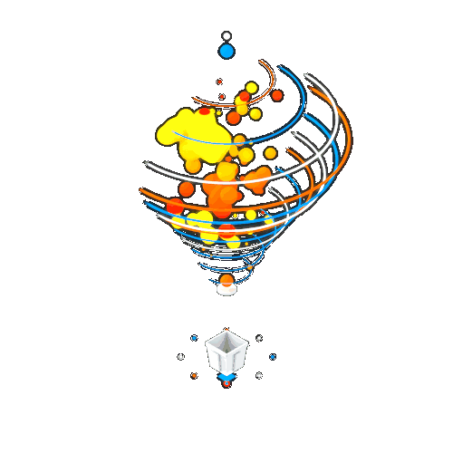
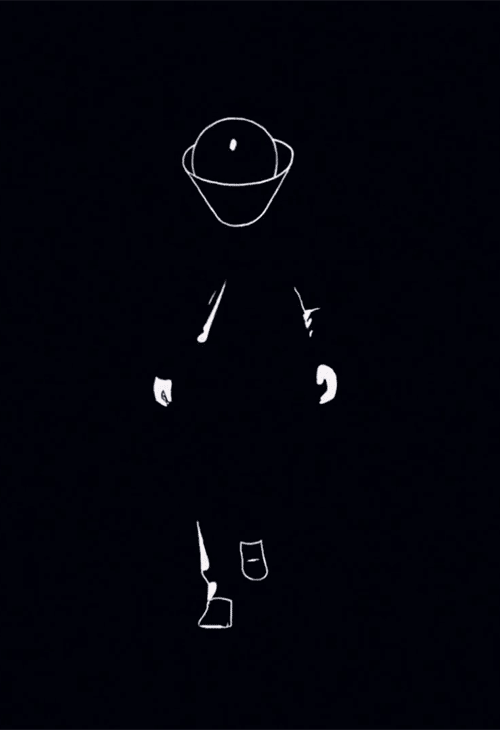

  
    <h1 style="color: #00FF41; font-family: 'Courier New', monospace; font-size: 24px; text-shadow: 0 0 10px #00FF41; margin: 8px 0;">
          ﹞EGALE 🦇 CODER﹝
    </h1>

  <table style="border-collapse: collapse; margin: 20px auto; background: linear-gradient(135deg, #0D1117, #1a1a2e); border-radius: 20px; overflow: hidden; box-shadow: 0 0 40px rgba(0, 255, 65, 0.3);">
    <tr>
      <td>
      <h1 style="color: #00FF41; font-family: 'Courier New', monospace; font-size: 17px; text-shadow: 0 0 10px #00FF41; margin: 8px 0;">
          ◢◣◥◤◢◣ Full Stack Developer ◢◣◥◤◢◣
    </h1>
 <h3 style="color: #1E90FF; font-family: 'Courier New', monospace; font-size: 16px; text-shadow: 0 0 8px #1E90FF; margin: 8px 0;">
  ◥◤◢◣◥◤ MERN Stack Development & API Design ◥◤◢◣◥◤
</h3>

<h3 style="color: #ADFF2F; font-family: 'Courier New', monospace; font-size: 16px; text-shadow: 0 0 8px #ADFF2F; margin: 8px 0;">
  ◢◣◥◤◢◣ Cloud Deployment & CI/CD Workflows ◢◣◥◤◢◣
</h3>

<h3 style="color: #FF4500; font-family: 'Courier New', monospace; font-size: 16px; text-shadow: 0 0 8px #FF4500; margin: 8px 0;">
  ◢◣◥◤◢◣ RESTful & Secure API Development ◢◣◥◤◢◣
</h3>

  <h3 style="color: #FF69B4; font-family: 'Courier New', monospace; font-size: 16px; text-shadow: 0 0 8px #FF69B4; margin: 8px 0;">
    ◢◣◥◤◢◣ AI-Powered Development & Automation ◢◣◥◤◢◣
  </h3>

<h3 style="color: #7FFF00; font-family: 'Courier New', monospace; font-size: 14px; text-shadow: 0 0 8px #7FFF00; margin: 8px 0;">
  ◢◣◥◤◢◣ DevOps & Cloud Automation (Azure / AWS) ◢◣◥◤◢◣
</h3>
      </td>
      <td style="padding: 10px; vertical-align: middle; background: radial-gradient(circle, rgba(0, 255, 65, 0.1), transparent);">
        
      </td>
    </tr>
  </table>

<!-- Snake Animation - TOP ONLY -->

  

<!-- Profile Counters with Neon Effect -->

  
  
  
  

<h3>✍️ Random Dev Quote</h3>

## 📊 **GitHub Analytics - Data Visualization**

  
  

<!-- Modified Streak Stats with Custom Values -->

  

## 🛠️ **Tech Arsenal - Weapons of Creation**

| **Tech Skills** |      |
|:---:|:---:|
| ** Frontend Mastery**   ** Backend & Cloud Power**   ** Development Arsenal**   ** Programming Languages**  |  |

  

<!-- Animated Connector Lines -->

  

<!-- Social Links with GIF Side by Side -->

  <table style="border-collapse: collapse; margin: 20px auto;">
    <tr>
      <td style="padding: 20px; vertical-align: middle;">
        <!-- Party Animation GIF -->
        
      </td>
      <td style="padding: 20px; vertical-align: middle;">
        <!-- Social Links Table -->
        <table style="border-collapse: collapse;">
          <tr>
            <td style="padding: 8px;">
              
            </td>
            <td style="padding: 8px;">
              
            </td>
          </tr>
          <tr>
            <td style="padding: 8px;">
              
            </td>
            <td style="padding: 8px;">
              
            </td>
          </tr>
          <tr>
            <td colspan="2" style="padding: 8px; text-align: center;">
              
            </td>
          </tr>
        </table>
      </td>
    </tr>
  </table>

<!-- Call to Action -->

  

<!-- Decorative Footer -->

  

---

## 📈 **GitHub Trophy Collection**

  

---

<!-- Winter Themed Sign Off -->

  

